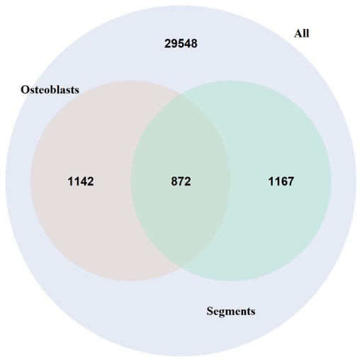

# Read me 

## ATAC-SEQ processing

### First steps: establishing significant peaks

The code for these steps can be found in "ATAC_analysis.sh". Commands are run on Linux Ubundu. 
Input data are raw sequencing files from an Illumina platform. 

The first step requires a document produced using the Illumina Experiment Manager program to demultiplex the samples. 
The remaining steps in this file do the following:

1. Sequence QC, bad sequence removal and adapter removal
2. Alignment to genome & generation of bam and BigWig files
3. Removal of mitochondrial reads, duplicate removal 
4. Read shifting | big wig generation
5. Calling significant peaks with macs2
6. TSS enrichment with ataqv

---

#### 1. Sequence QC, bad sequence removal and adapter removal
Using fastp, without removing duplicates on this step. Reports for each sample in .html files produced as output.

#### 2. Alignment to genome & generation of bam and BigWig files
Using bowtie2 and samtools for ultimate generation of sorted and indexed BAM alignment files.

Using the deeptools command bamCoverage to generate bigwig files. These are used to visualise the alignment results prior to removing sequences deemed duplicated or non-significant, which is done in latter steps. 

#### 3. Removal of mitochondrial reads, duplicate removal 
Using the bedtools intersect command to remove mitochondrial reads. If the chromatin preparation was successful, more than 90% of reads will be kept in this step. For Danio rerio, generation of a sorted and indexed BAM file containing the full mitochondrial genome is shown in the beginning of the script (lines 4-10). The input fasta file for this can be generated using Ensembl.

sambamba is used for removing duplicates from the resulting nuclear reads file. Typically, here a large chunk of the reads are removed, although for samples with adequate chromatin the removed reads should be reduced.

files with suffix "_aligned_uniq.bam" indicate nuclear, unique sequences.

At this stage, additional files with suffix "_ataqv_sorted.bam" plus indices are generated for downstream processing with ATAQV, to indicate TSS enrichment and other metrics used for sample QC.

#### 4. Read shifting | big wig generation
Read shifting is essential in ATAC-SEQ sample processing, since the Tn5 transposome used in sample preparation produces artefacts on each read pair. These modifications are accounted for here. The deeptools command alignmentSieve is used for the shifting of reads. 

Here the deeptools bamCoverage command is again used to produce bigwig files, this time following duplicate removal, but again before reads deemed "non-significant" have been removed.

#### 5. Calling significant peaks with macs2
Using the output from read shifting, for each sample we create both narrowpeak and broadpeak using macs2. Here, we use the options 
-g 1.412e9 --keep-dup all --nomodel --shift -100 --extsize 200

Results for each set of outputs will be stored in automatically generated directories, the names of which can be tweeked prior to running the loop.

#### 6. TSS enrichment with ataqv 

For TSS enrichment analysis, make sure to add the additional dependencies (different versions required compared to previous).

Inputs here: 
1. {sample_name.ataqv_sorted.bam} file produced previously.
2. txt files listing autosomes for organism of interest. This file should include no text, except vertically listed chrom codes from RefSeq.

The output for each sample has the file extension .ataqv.out. With the next mkarv command, outputs of all samples are taken together to generate the resulting metrics.

---

### Differential accessibility analysis (R) and Motif enrichment analysis (Linux)

In the subsequent stages of ATAC-SEQ analysis, the DiffBind package in R is utilised to generate lists of peaks corresponding to areas of the genome that are differentially accessible between sample groups.

Outputs of DiffBind are used as inputs for Motif enrichment analysis using HOMER.

#### Diffbind (R)

DiffBind was used according to the package documentation (https://bioconductor.org/packages/release/bioc/vignettes/DiffBind/inst/doc/DiffBind.pdf) to identify differentially accessible chromatin regions between samples and controls. The code can be found in the "ATAC_DiffBind.R" script.

As input, the .narrowPeak files from macs2 output were used. For read counts, the summits parameter is set to 150. Default normalisation is applied.

The script includes code run to generate HOMER-readable files for motif enrichment analysis (see next step)

#### Motif enrichment analysis with HOMER

HOMER is used to identify enriched predicted transcription factor binding sites in differentially accessible chromatin regions (from DiffBind). The code can be found in the end of the script titled "ATAC_analysis.sh".

The relevant packages have to be exported. Here the zebrafish packages are configured. This is done once. 
For more information visit http://homer.ucsd.edu/homer/introduction/configure.html

We run the command findMotifsGenome.pl with the .bed file from DiffBind as input, to acquire two outputs:
1. A list of "known" predicted TF binding sites
2. A list of novel "homer" predicted binding sites

## RNA-SEQ processing

### First steps: read counts

The code for these steps can be found in "RNAseq_analysis.sh". Commands are run on Linux Ubundu. 
Input data are fastq.gz files from Eurofins Genomics.

The RNAseq data are processed as follows:

1. Ensuring all reads for each sample are in a single fastq.gz file
2. QC, duplicate and adapter removal
3. Alignment to the D. rerio genome 
4. Track visualisation
5. Read counting
6. Metric visualisation from log files

---

#### 1. Ensuring all reads for each sample are in a single fastq.gz file

This step is in case the reads for a sample are split in separate .fastq.gz files. All reads for each processed sample have to be in a single file for downstream processing.

#### 2. QC, duplicate and adapter removal

fastp is used for QC, where bad sequences and adapters are removed. Here, the --dedup option is added to remove duplicates. Reports for each sample in .html files produced as output.

#### 3. Alignment to the D. rerio genome 

The Spliced Transcripts Alignment to a Reference (STAR) aligner is used one-off to index the reference genome. RNA-SEQ read alignment is carried out using the STAR aligner. samtools commands are used to convert output files to BAM format, as well as to sort and index.

#### 4. Track visualisation

The deeptools command bamCoverage is used to generate bigwig files, to visualise the alignment results. Specific options: --normalise using BPM (bins per million)
--exactScaling

#### 5. Read counting

featureCounts command from the Subread package is used to count reads. An annotation file is requested in .gtf format. This can be generated in ENSEMBL or in NCBI.  

#### 6. Metric visualisation from log files

Metrics are visualised using multiqc. Both STAR and featureCounts log files are analysed.

---

### Differential expression analysis (R)

In the subsequent stages of RNA-SEQ analysis, the DESEQ2 package in R is utilised to determine differentially expressed genes. The code can be found in file named "RNAseq_DESEQ2.R".

## Integration 

The goal of ATAC and RNAseq data integration is to gain more insight in gene regulation by 
(a) revealing which genes that are differentially expressed in a cell population of interest AND have open chromatin in their regulatory regions (either located upstream of the TSS or within introns of the gene)
(b) extracting the ATAC peaks within the promoters of differentially expressed genes (DEGs), and using HOMER to predict in silico which TFs could bind and regulate the DEGs.

### Data preparation

In the code file "Integr_ATAC_RNAseq_DataPreparation.R" the pre-processing of files necessary for integrative analysis is shown. 

Lines 9-53 are used to read all known transcripts with their locations on the Zv11 reference genome, and generate a file with "Promoter Start" and "Promoter End" columns to identify the likely areas containing regulatory elements for each transcript (Fig. 1).

Figure 1

Lines 58 to 79 show preprocessing of RNAseq analysis results, aka filtering for DEGs with log2FC of over 0.5 (significantly upregulated in cell population X) or log2FC of under -0.5 (significantly downregulated in cell population X). The file is also simplified by keeping only a single entry for each gene (removing entries corresponding to multiple transcripts).

Lines 87-122 show comparisons between DEGs of different cell types (here positively regulated genes in populations X vs Y). An example output is shown in Fig. 2).

Figure 2

### Intersecting ATAC and RNAseq data

The code for this step is found in file "Intersecting_ATAC_toAllGenes.R"

The procedure followed is showed in Figure 3. In short, first the promoters identified during data preparation are scanned for ATAC peaks enriched in the cell population of interest (output of DiffBind, see file ATAC_DiffBind.R). The function Genes_with_Peaks used here is diagrammatically explained in Figure 4.

Genes are then filtered according to the RNAseq data (if they are upregulated in that cell population). Finally, the ATAC peaks found in regulatory region of those genes are extracted and used as input for HOMER (not shown here). 

The outcome of this analysis is a list of transcription factors with the potential of binding and regulating the list of genes that are differentially regulated and that have active regulatory regions in the population of interest.

Figure 3

Figure 4